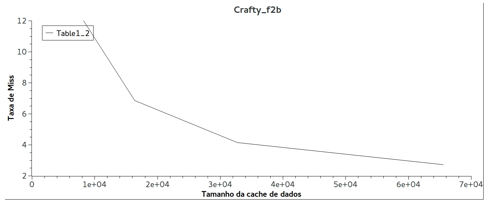
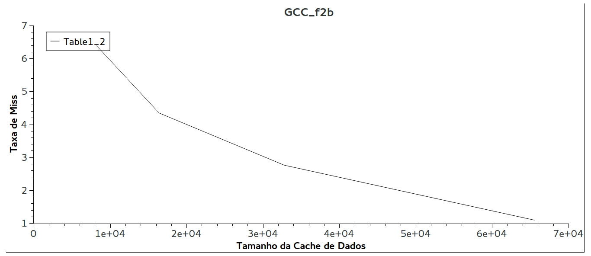
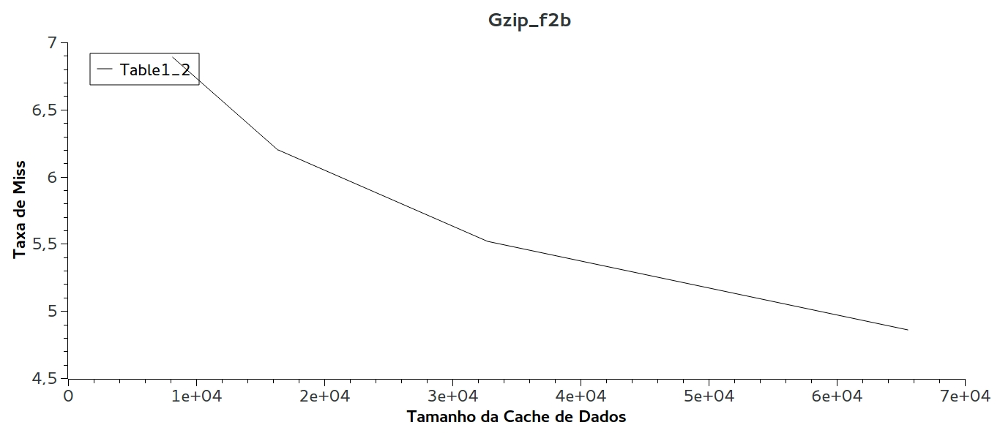
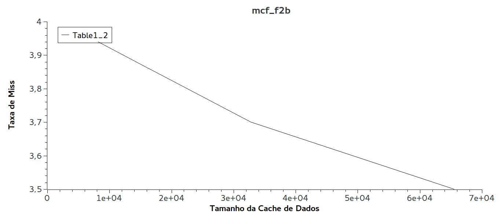

# Exercício 2 - Configuração de Cache
## Nome: Guilherme Lucas da Silva
## RA: 155618

## 1. Introdução  
Desde a criação dos primeiros computadores anos atrás, existe uma gigantesca competição para definir qual desses é o mais eficiente, rápido ou potente. Para alcançar esse objetivo, muitas técnicas diferentes foram desenvolvidas, entre elas paralelização de código em arquiteturas multiprocessadas, processadores mais rápido, compiladores com várias features e melhoria nas memórias. Nessa ultima categoria, além do desenvolvimento de memórias com acesso e escrita cada vez mais rápidas, foram criadas as memorias cache, memórias que ficam extremamente próximas do processador, resultando em um acesso extremamente rápido. Após o advento desse tipo de memória, começaram a estudar maneiras de deixá-las ainda melhores. Entre as alterações que podem ser feitas são, tamanho total da cache, tamanho de cada bloco de memória e associatividade, que é basicamente uma função que mapeia cada dado na memória. Dito isso, esse experimento procura realizar vários testes em caches com diferentes características, para que possamos concluir qual a melhor combinação de atributos.

## 2. Resumo
Para realizar esse exercício, o primeiro passo foi instalar o **DineroIV**, com as informções dadas pelo professor na página do exercício. Depois disso, escrevi o script **cache_size.sh** que testa, para os quatro programas escolhidos **(crafty_f2b, gcc_f2b, gzip_f2b, mcf_f2b)**, tamanhos de cache entre **8k** e **64k**, para podermos analisar qual o tamanho da o melhor "custo-beneficio". Depois disso, fixamos o melhor tamanho e começamos a variar associatividade e tamanho de bloco, também por meio do script, conseguindo assim plotar gráficos e mostrar dados importantes sobre desempenho para cada configuração de cache.

## 3. Procedimento
Após instalar o **DineroIV** com as instruções que estavam na página do exercício, usei o script **cache_size.sh** para encontrar o tamanho que me dava o melhor "tamanho-benefício". Dentro da pasta **cache_size_results** temos os resultados para vários tamanhos de cache para os programas analisados. Estes arquivos estão nomeados de acordo com o nome do programa que esta sendo analisado.  
Aqui, vale ressaltar que usamos a flag **-maxtrace 20** devido ao tempo extremamente grande que o teste estava gastando sem essa flag, falhando muitas vezes por queda de conexão com o **SSH** ou tinha que interrompê-los devido a alguma aula que ia acontecer na sala que eu estava realizando testes. Além disso, **20** foi uma opção que o professor sugeriu e que já nos dá um ótima noção de desempenho da cache.  
A princípio, pensei em plotar dois gráficos para cada tamanho e programa, analisando a taxa de miss **cache de dados** e a **cache de instruções**. Porém, é possível notar pelos resultados no diretorio **cache_size_results** que a taxa de miss na **cache de instruçõs** é bem pequena, em todos os casos. Considerando isso e o fato de que buscar dados na memória é uma operação extremamente custosa e lenta, decidi plotar e analisar os gráficos com a taxa de miss na **cache de dados**. Abaixo encontram-se as análises:  

  

  

  

  

Como podemos notar pelos gráficos, o aumento do tamanho da cache, para todos os casos tem uma melhora muito grande na taxa de miss. Apesar do último gráfico mostrar pouca melhora, os outros três tem diminuição de miss praticamente exponencial ao dobrar o tamanho da **cache de dados**. Por esse motivo, decidi que vale a pena usar a cache de maior tamanho para os testes posteriores. Desta maneira, fixaremos o tamanho da **cache de dados** e da **cache de instruções** como sendo **64k**.  

   
