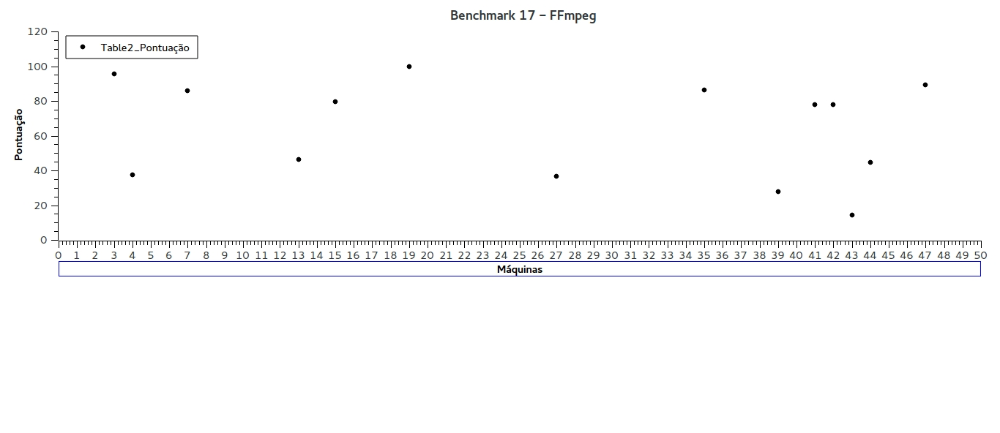

# Parte 3 - Relatório de Desempenho
## Nome: Guilherme Lucas da Silva
## RA: 155618

## 1. Introdução
Conseguir distinguir dispositivos computacionais pelos seus desempenhos é extreamente importante hoje em dia, uma vez que estamos submetidos a um ritmo que exige produção de altíssima qualidade o mais rápido possível, como a máxima contemporânea diz: "tempo é dinheiro". Dessa maneira, a busca por métodos que avaliem de maneira precisa o quão boas são essas máquinas é incessante.  
Após realizar uma série de benchmarks com diferentes máquinas possuímos em mãos uma infinidade de dados que nos permitem criar uma maneira para avaliar essas máquinas, procurando classificá-las.  

## 2. Resumo  
Ao longo desse experimento, escolheremos uma maneira de rankear as máquinas de acordo com os resultados obtidos nos passos anteriores. Para fazer isso da melhor maneira, lancei um olhar crítico sobre os resultados na planilha e descartei alguns dados, por serem esdrúxulos, programas usados para benchmark com poucos dados e projetos que não aprentavam dados sufiecientes, somente mostrando a pontuação final, por exemplo.

## 3. Procedimentos
O primeiro passo para analisar as máquinas descritas foi observar as planilhas de dados de cada programa para decidir se alguns deles não seriam avaliados. No fim das contas, além dos programas que o professor desclassicou, decidi não usar os listados abaixo:   
- **NAS Parallel (10):** poucas medidas.  
- **AES Crypto (12):** também foram executadas poucas medidas.  
- **Sorting (16):** usava somente dados baseados no tempo, gerando o score final a partir disso.  
- **AES with CBC (18):** também possui poucas medidas realizadas.  
- **FFTW (19):** somente três medidas foram feitas.  

Além disso, tive que olhar para cada benchmark e analisar o que as notas altas representavam, ou seja, listar quando altas notas representavam um melhor ou pior desempenho. Porém, somente o **GNU GZip** foi diferente nesse aspecto, sendo as maiores notas representando os piores desempenhos.  
Feito isso, notei que teria problema em comparar o desempenho das máquinas, uma vez que as pontuações não eram padronizadas, ou seja, não variavam dentro de um intervalo fixo. Visto isso, tive que padronizar todos os scores, colocando-os em um intervalo de **0** a **100**, fazendo com que o maior de todos eles se tornasse o **100**. Simplificando, cada nova nota **Z(N)** baseada no antigo score **N** é dada pela seguinte fórmula:  
  
**Z(N) = (N/maiorValor)x100**  

Vale ressaltar que **maiorValor** é o maior valor dentro do benchmark que esta sendo analisado no momento.    
Fazendo o método citado acima, é possível definir a pontuação em cada caso, ou seja, analisar de maneira crítica qual computador se da melhor em cada tipo de tarefa. Porém, para obter uma média e conseguirmos estimar qual a melhor máquina de maneira geral, fazemos uma media de nota, por meio da soma das pontuações dos benchmarks que a maquina participou divido pelo número de benchmarks.  

## 3.1 Gráficos e pontuações normalizadas  
Plotamos os gráficos para cada benchmark, ou seja, a pontuação das máquinas participantes para cada programa. Lancei mão de dois softwares para esse passo: o **SciDavis** que é exclente para plotar gráficas de maneira muito simplista e o **LibreOffice Calc**. Segue abaixo as pontuações calculadas a partir da fórmula mostrada acima e os gŕaficos de cada teste:  

**Benchmark 1 - Gnu Plot**  

| Pontuação | Máquinas |
|-----------|----------|
| 100       | 11       |
| 78        | 7        |
| 28        | 55       |
| 80        | 16       |
| 34        | 21       |
| 70        | 22       |
| 78        | 19       |
| 72        | 35       |
| 22        | 43       |
| 80        | 34       |
| 30        | 40       |
| 76        | 33       |
| 72        | 36       |
| 70        | 26       |
| 70        | 25       |
| 64        | 32       |
| 76        | 52       |
| 90        | 51       |
| 88        | 12       |
| 48        | 31       |

**Benchmark 2 - x264**  

| Pontuação            | Máquina |
|----------------------|---------|
| 35,2800921740000035  | 2       |
| 31,0947010757000015  | 4       |
| 67,8914604665999946  | 7       |
| 68,1721370906000033  | 12      |
| 26,5849542125999996  | 14      |
| 68,3273128621000012  | 16      |
| 70,4661726788999943  | 16      |
| 49,4011950240999980  | 18      |
| 100,0000000000000000 | 20      |
| 39,7462574708999981  | 21      |
| 67,5318658374000051  | 22      |
| 71,6986693757999944  | 24      |
| 63,5460119187000032  | 28      |
| 34,1121714881999978  | 30      |
| 34,2165231521000024  | 31      |
| 66,0592745702000030  | 41      |
| 11,7904648696999992  | 43      |
| 37,6552642892999998  | 44      |
| 58,3234731040000014  | 45      |
| 95,8334798061000015  | 46      |
| 12,0103240215000007  | 47      |
| 25,3283716353999999  | 55      |  

  

**Benchmark 4 - GCC + Kernel**  

| Pontuação  | Máquina |
|------------|---------|
| 51,773     | 4       |
| 31,2057    | 7       |
| 56,0284    | 12      |
| 25,8865    | 13      |
| 62,0567    | 16      |
| 43,9716    | 17      |
| 100        | 19      |
| 60,9929    | 20      |
| 36,5248    | 21      |
| 36,8794    | 22      |
| 74,8227    | 31      |
| 29,4326    | 34      |
| 98,9362    | 35      |
| 34,3972    | 39      |
| 34,0426    | 40      |
| 51,773     | 43      |
| 26,9504    | 55      |

**Benchmark 7 - fft + deep learning**  

| Pontuação         | Máquina |
|-------------------|---------|
| 26,2981574539     | 6       |
| 99,0787269682     | 7       |
| 72,1943048576     | 8       |
| 88,52596314909999 | 14      |
| 66,41541038530001 | 23      |
| 86,0971524288     | 30      |
| 100               | 33      |
| 100               | 35      |
| 98,32495812400001 | 36      |
| 80,40201005030001 | 37      |

**Benchmark 9 - GraphicsMagick**  

| Pontuação      | Máquina |
|----------------|---------|
| 60,676480672   | 7       |
| 100            | 15      |
| 62,2302210902  | 20      |
| 70,9206173099  | 27      |
| 37,090319518   | 30      |
| 157,4282026579 | 36      |
| 23,0986293243  | 39      |
| 99,7478420807  | 45      |
| 56,5410156401  | 46      |
| 38,9571908426  | 54      |

**Benchmark 14 - Solver**

| Pontuação         | Máquinas |
|-------------------|----------|
| 73,8258679198     | 4        |
| 67,0010095301 | 6        |
| 60,3137178771     | 8        |
| 70,6665916277     | 10       |
| 58,0476859242     | 14       |
| 62,7996147993     | 15       |
| 62,5474186396     | 17       |
| 62,3807040056     | 23       |
| 57,3395323871     | 25       |
| 61,5436159204     | 26       |
| 74,4569333663 | 28       |
| 72,2282668685     | 30       |
| 65,0007277566     | 30       |
| 76,6478806927     | 32       |
| 79,2599040612     | 34       |
| 62,8807793531     | 35       |
| 100               | 36       |
| 95,1474101977     | 37       |
| 75,3888793022     | 38       |
| 36,1413673549     | 40       |

**Benchmark 15 - MatPlotlib**  

| Pontuação     | Máquinas |
|---------------|----------|
| 100           | 4        |
| 30,3955586398 | 6        |
| 61,7626648161 | 7        |
| 66,9673837613 | 15       |
| 43,0950728661 | 23       |
| 47,5364330326 | 24       |
| 40,5968077724 | 27       |
| 42,8174878557 | 34       |
| 82,6509368494 | 39       |
| 87,092297016  | 40       |
| 68,2859125607 | 42       |
| 50,2428868841 | 45       |
| 48,3691880638 | 46       |

**Benchmark 17 - FFmpeg**  

| Pontuação         | Máquinas |
|-------------------|----------|
| 95,3872728131     | 3        |
| 37,5604775546     | 4        |
| 85,936818508      | 7        |
| 46,3123700499     | 13       |
| 79,5542085829     | 15       |
| 100               | 19       |
| 36,501567435      | 27       |
| 86,1108801522     | 35       |
| 27,7527449748     | 39       |
| 77,75999605760001 | 41       |
| 77,87553210439999 | 42       |
| 14,1566060644     | 43       |
| 44,6523664954     | 44       |
| 89,32742126540001 | 47       |

## 3.2 Tabela final  
O gráfico e a tabela abaixo dizem respeito a pontuaçao final obtida por cada máquina. Essa pontuação final **PF(x)** foi obtida a partir da seguinte fórmula:

**PF(x) = SomaTodos(x)/Ntotal(x)**  

onde **SomaTodos(x)** é a soma dos valores de todos os benchmarks que a máquina participou e **Ntotal(x)** é o número de benchmarks que a máquina participou. Ou seja, essa fórmula, na verdade, está calculando a média entre as notas dos benchmarks de cada máquina. Para esse tratamento, criei um script chamado **final.py** que me da todos os resultados desejados. Abaixo a tabela da pontuação o obtida:  

| Máquina | Pontuação         |
|---------|-------------------|
| 19      | 92,59999999999999 |
| 51      | 90                |
| 33      | 88                |
| 37      | 87,77             |
| 35      | 83,98             |
| 15      | 77,33             |
| 52      | 76                |
| 38      | 75,08             |
| 20      | 74,40000000000001 |
| 41      | 71,90900000000001 |
| 12      | 70,73             |
| 10      | 70,66             |
| 32      | 70,31999999999999 |
| 16      | 70,20999999999999 |
| 45      | 69,43000000000001 |
| 7       | 69,2              |
| 28      | 69                |
| 46      | 66,91             |
| 8       | 66,25             |
| 26      | 65,77             |
| 25      | 63,669            |
| 24      | 59,61             |
| 30      | 58,9              |
| 4       | 58,85             |
| 22      | 58,12             |
| 34      | 57,877            |
| 14      | 57,7              |
| 23      | 57,29             |
| 17      | 53,25             |
| 31      | 52,34             |
| 47      | 50,668            |
| 18      | 49,4              |
| 27      | 49,33             |
| 40      | 46,81             |
| 39      | 41,97             |
| 6       | 41,23             |
| 44      | 41,12             |
| 54      | 38,95             |
| 21      | 36,75             |
| 13      | 36,09             |
| 2       | 35,28             |
| 55      | 26,75             |
| 43      | 24,9              |

## 3.3 Análise detalhada
Nesta seção, falaremos de maneira mais detalhada sobre os projetos que realizamos os benchmarks.  
- **x264:** projeto usado para codificar e decodificar vídeos muito comum na internet foi usado para benchmark por exigir bastante de vários recursos da máquina. Neste caso, foram analisados tempo de execução, para que pudéssemos analisar o tempo decorrido entre o inicio e o fim da tarefa, cache miss, que dá uma ótima moção do quão boa a cache do computador pesquisado é, e page fault, que analisa o auxílio da memória ram durante a execução de um processo.  

- **GNU Gzip:** padrão de compressão mais comum na internet, esse benchmark visou analisar o tempo, que é uma ótima métrica, já que o usuário final realmente só deseja não ficar esperando na frente da máquina, uso de cpu, para saber se esse programa funciona bem com outros processos rodando e não usa todo o processamento para ele e quantia total de memoria, também ajudando na análise se esse programa lida bem com outros processos rodando simultaneamente na máquina.  

- **Solver:** Solver foi um benchmark bem completo. Entre as características com suas importâncias já citadas nos outros dois programas estão tempo de execução, cache miss e porcentagem de tempo de disco. Além disso, ele analisa a porcentagem de branch misses, muito importante para identificar a eficacia do algoritimo de branch prediction, já que branches são operações custosas. Também analisam a porcentagem de TLB misses, permitindo assim analisar necessidade de aumentar ou melhorar a organização da TLB.  

## 4. Conclusão
Após realizar todos os testes em tarefas muito distintas e máquinas também com características totalmente heterogêneas umas das outras, é possível notar que existem máquinas melhores na média. Porém, essa média pode não ser o melhor valor para ser analisado, uma vez que, certos computadores tem desempenhos explêndidos quando executam um tipo de teste muito específico, porém, sua performance despenca ao realizar tarefas mais abrangentes, por exemplo.  

 

